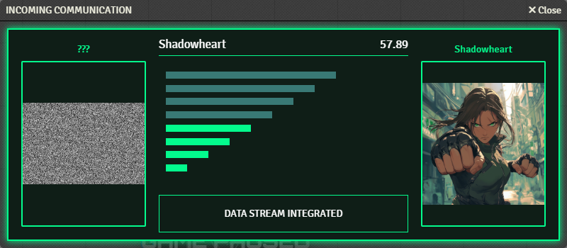
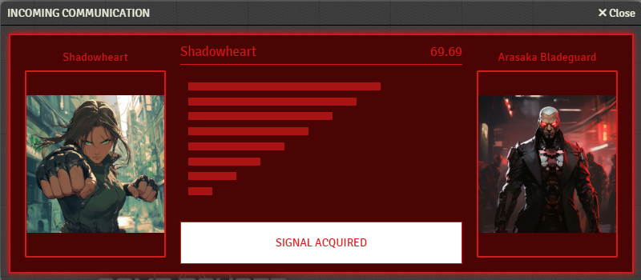
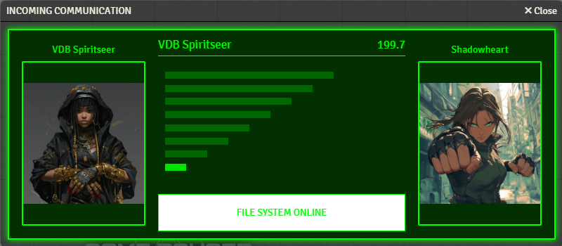

# FoundryVTT MGS Style Communication


---
## Overview

Snake? Snake? SNAAAAAAKE!!!
Got your attention? Good. Incomming transmission!
Add flair to your Foundry Games with a classic Science Fiction update with insipiration from Metal Gear Solid Codec screen!



## Features

Select tokens from your scene and pull up a custom MGS Styled Codec Communication screen between your players for added roleplay theme. Additionally, the Codec Communication screen handles Themes just like our previous [FoundryVTT RSS Scroller](https://github.com/KaiibottAI/foundry-rss-scroller)!




## Installation

1. Paste the `module.json` into your Foundry Module Manifest or clone the module into your FoundryVTT modules directory.

```
https://raw.githubusercontent.com/KaiibottAI/metal-gear-codec/main/module.json
```

or clone the repo to your FoundryVTT modules directory.

```cmd
git clone https://github.com/KaiibottAI/metal-gear-codec.git
```

2. Add the module to your game via Manage Modules in FoundryVTT.
3. Enable it in your world modules.

## How Does It Work?

The Codec Communication screen will supply the Name and Image for the left and right sides by the GM's currently selected tokens. If you select only one (1) token, their details will be supplied to the right side of the Codec screen while if you select two (2) tokens, the first token will supply the left side and the second token will supply the right side. These utilize the `actor.img`, so if you have different art for the Portrait and the Token, this will ultilize the portrait.

## Macros available

Toggle the Codec Communication Window. This macro is included in a compendium on install for ease of access. This is only usable by the active GM of the world.
```javascript
openCodecForAll();
```
